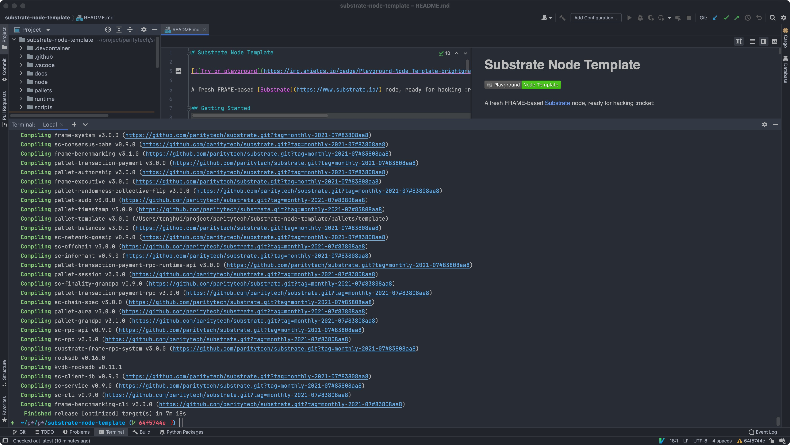
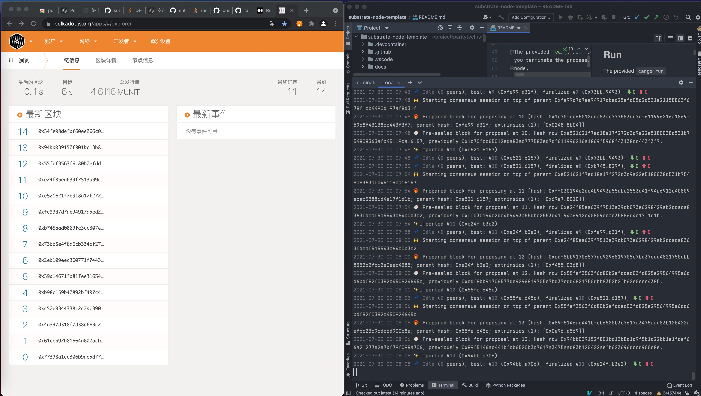
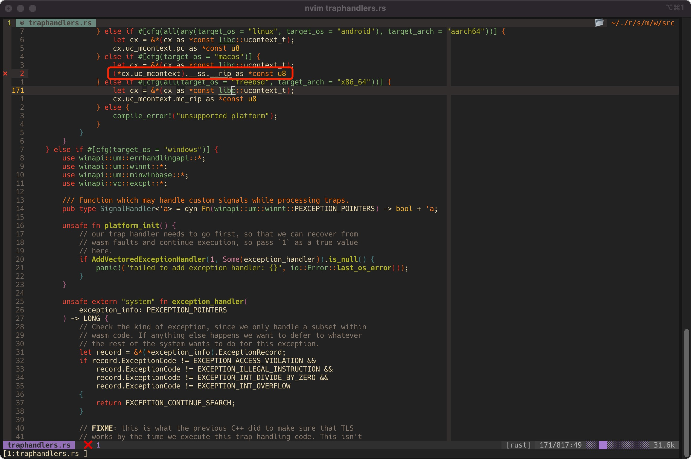
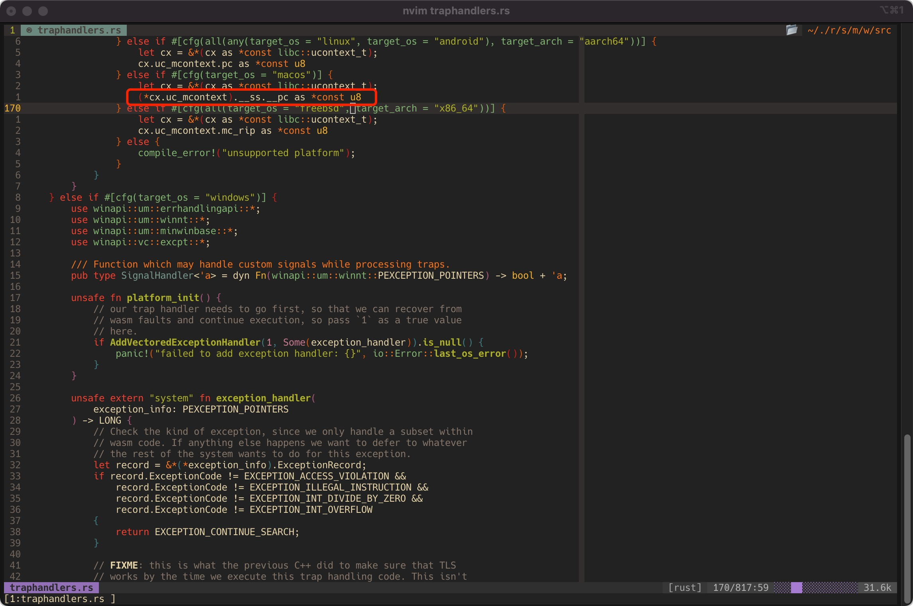
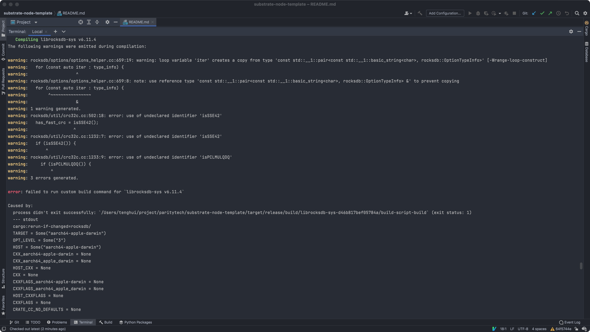

# 快速启动

## 单节点

1. 下载源码
2. `cargo build —release` 编译项目
3. `./target/release/substrate —dev` 运行，dev默认单节点
4. 打开浏览器 https://polkadot.js.org/apps 并连接本地节点
5. ` ./target/release/node-template purge-chain --dev` 清除节点数据

## 多节点

1. 下载源码
2. 编译
3. `./target/release/substrate --alice --chain local` 启动第一个节点，此时是不会出块的
4. `./target/release/substrate --bob --chain local --base-path /tmp/bob` 启动第二个节点
5. 打开浏览器 https://polkadot.js.org/apps 并连接本地节点查看出块情况
6. `rm -rf /tmp/alice && rm -rf /tmp/bob` 清除节点数据

# 模块定义概览

```rust
// 导入依赖
use support::{decl_module, decl_storage, decl_event, ...};
// 定义关联类型
pub trait Trait: system::Trait {...}

// 声明Runtime的地方
// 声明存储
decl_storage! {...}
// 声明事件
decl_event! {...}
// 声明错误
decl_error! {...}
// 声明用户可以调用的runtime的方法
decl_module! {...}
// 用户不可调用，提供给当前pallet的一些工具方法
// 或者给其他模块调用的方法
impl<T: Trait> Module<T> {...}
```

## 引入和定义关联类型

## 定义存储

## 定义事件

## 定义可调用函数

## 定义公共和私有函数

# substrate-node-template

## 编译成功截图



## 运行成功截图



## 使用 M1 Mac 编译踩的坑


### 依赖库有问题

开始使用的是[v3.0.0+1](https://github.com/substrate-developer-hub/substrate-node-template/tree/v3.0.0+1)版本，编译会报如下错误：

```
error[E0609]: no field `__rip` on type `__darwin_arm_thread_state64`
   --> crates/runtime/src/traphandlers.rs:169:44
    |
169 |                     (*cx.uc_mcontext).__ss.__rip as *const u8
    |                                            ^^^^^ unknown field
    |
    = note: available fields are: `__x`, `__fp`, `__lr`, `__sp`, `__pc` ... and 2 others
```

一个依赖库又问题，在*cargo*下的如下路径：*.cargo/registry/src/mirrors.tuna.tsinghua.edu.cn-df7c3c540f42cdbd/wasmtime-runtime-0.22.0/src/traphandlers.rs*



需要把`__rip`改成`__pc`，如下图：



### 另一个没能解决的错误

第一个错误修改完成后，在后面的编译中遇到另一个错误，没能解决，如下图：



## 如何运行成功的

最后又回到了官方文档，官方文档提示建议尝试最新的 substrate-node-template 代码：[latest](https://github.com/substrate-developer-hub/substrate-node-template/tree/latest)

切换到该tags下正常运行。（在前面的课程build substrate的时候是没有出现任何问题的，可能是substrate的依赖都比较新？）

# SubStrate学习网站

- Substrate 官方文档：https://substrate.dev/docs/en/
- Substrate 的 recipe ：https://substrate.dev/recipes/
- Substrate 的 rust docs ：https://substrate.dev/rustdocs/latest/sc_service/index.html
- Substrate 的 tutorial ：https://substrate.dev/en/tutorials
- Substrate Seminar：https://substrate.dev/en/seminar  (两周一次，周二 14:00)

